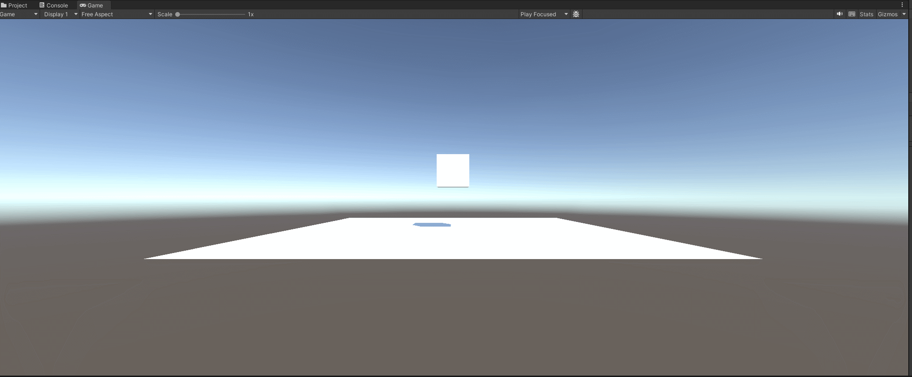
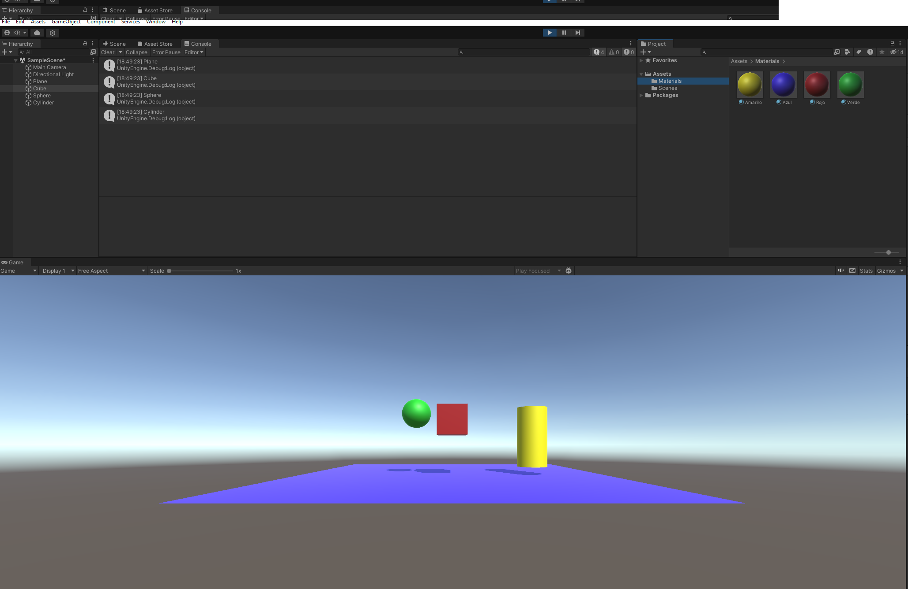
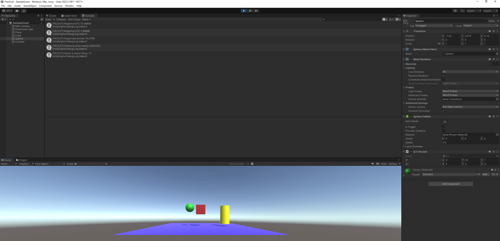
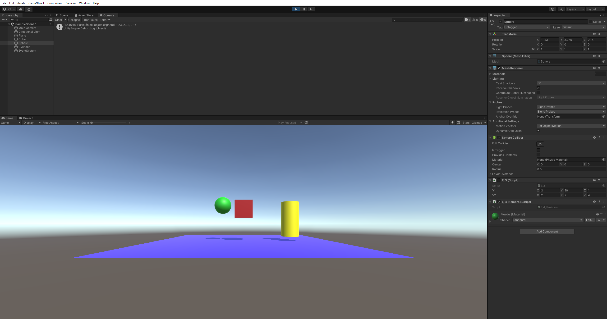
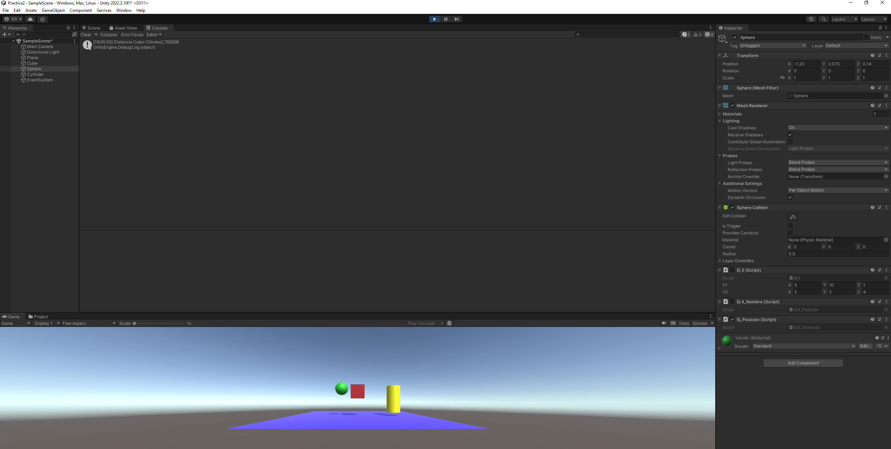
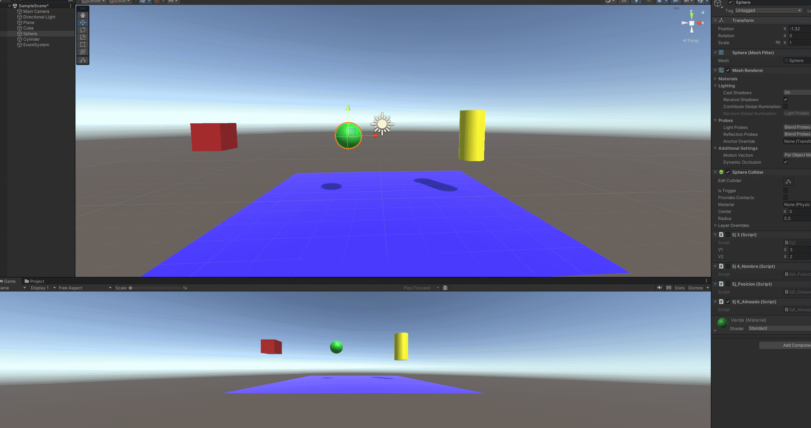
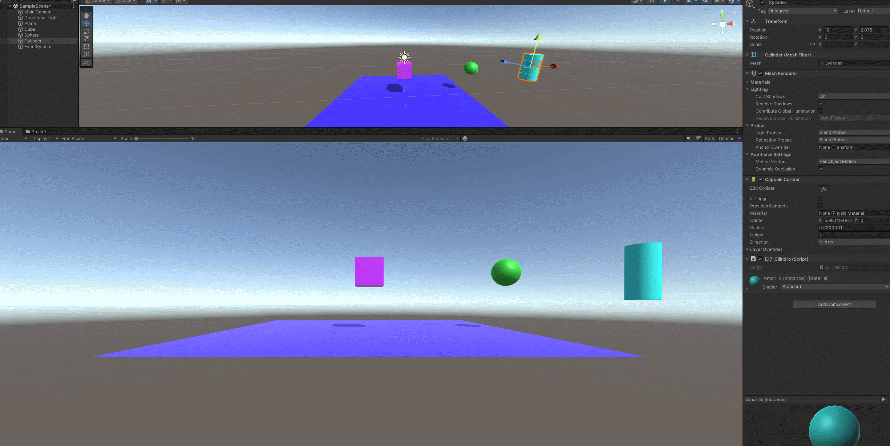
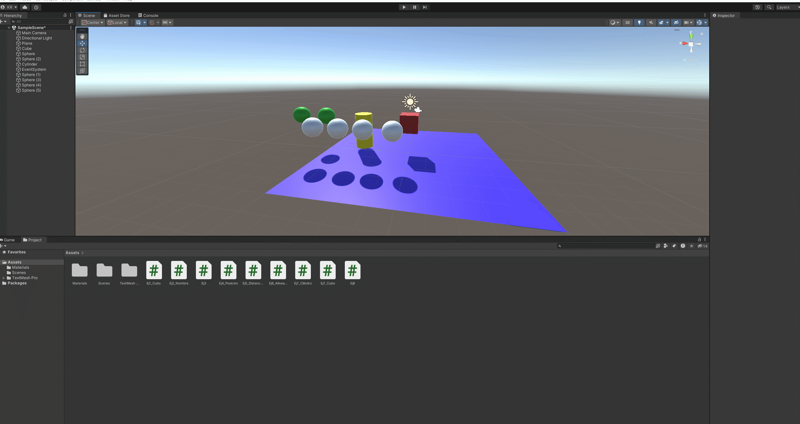

# Prct2_II
## Ej1
Inicializamos un objeto vector3 a modo de array para configurar la posición de nuestro cubo, tras ello generamos una posición aleatoria inicial. Por último elegimos uno de los 3 ejes de manera aleatoria y cambiamos su valor en el rango 0-25, esto se realizará cada frame.

## Ej2
Ejercicio donde creamos materiales para aplicarlos a nuestro GameObjects

## Ej3
Script que muestra algunos datos por pantalla acerca de la relación ente dos vectores dentros de la esfera

## Ej4
Script para mostrar por pantalla la posición de la esfera

## Ej5
Script para mostrar la distancia entre el cubo y el cilindro

## Ej6
Script para que la esfera tenga a 5 unidades a la derecha y 5 a la izquierda el cubo y el cilindro.

## Ej7
Scripts para cambiar los colores del cubo y el cilindro dependiendo del input

## Ej8
Script para calcular la distancia de cada esfera respecto al cubo, dentro de un grupo de esferas con un tag concreto, ascender la que esté más cerca, 1 unidad hemos decidido, y cambiar el colo de la más lejana al pulsar el espacio.

