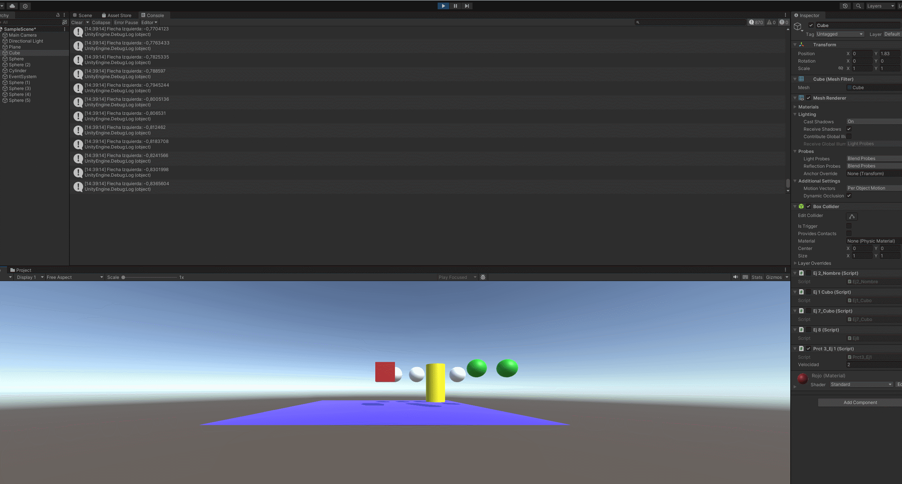
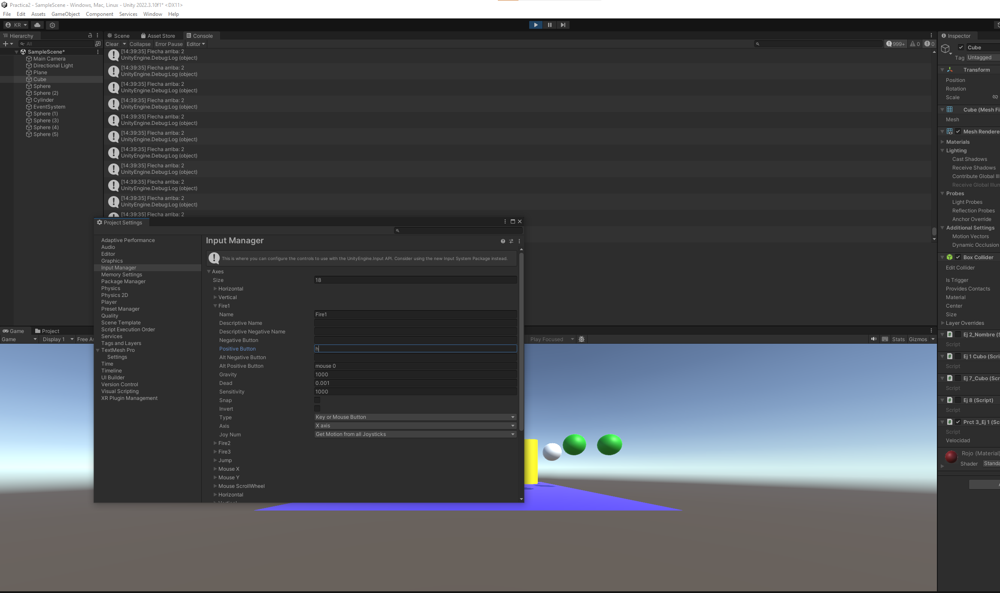
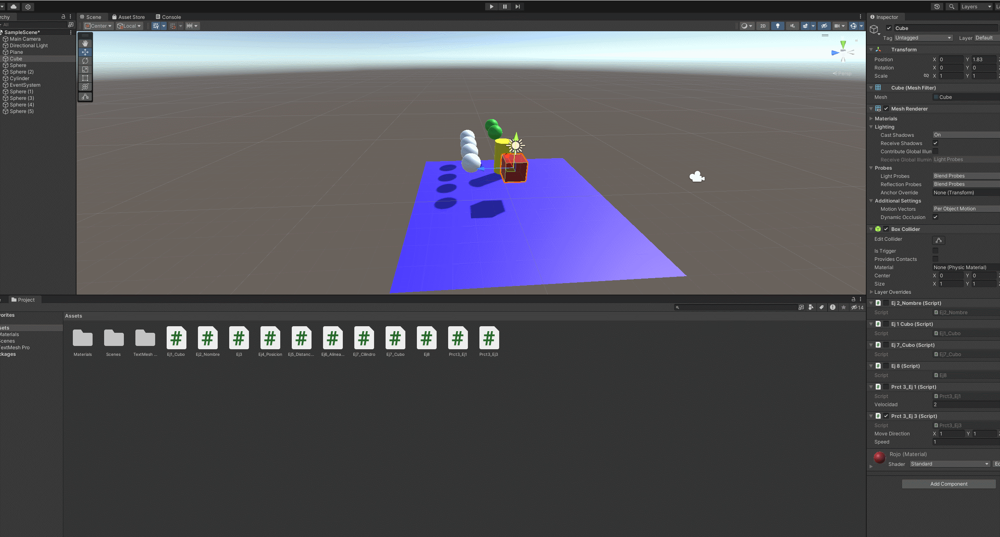
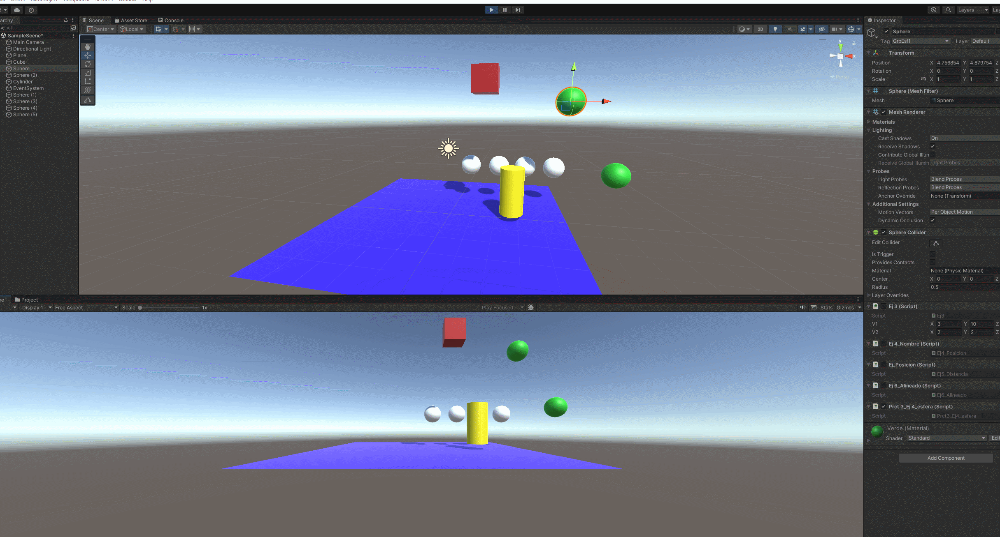
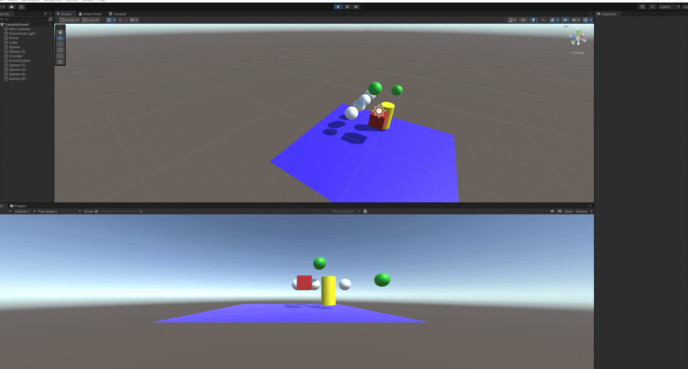
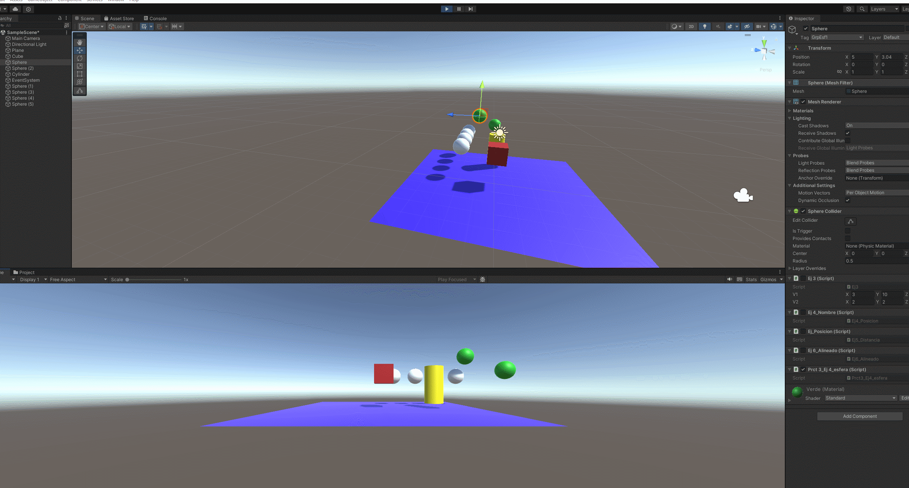
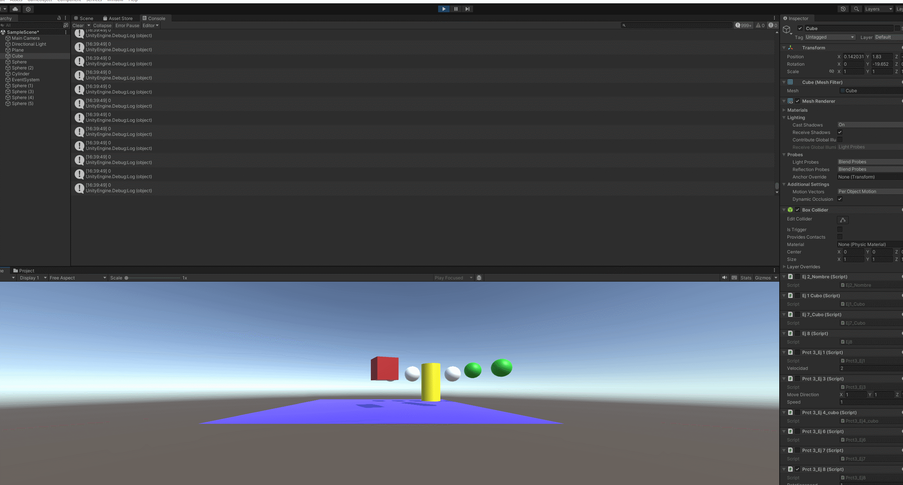
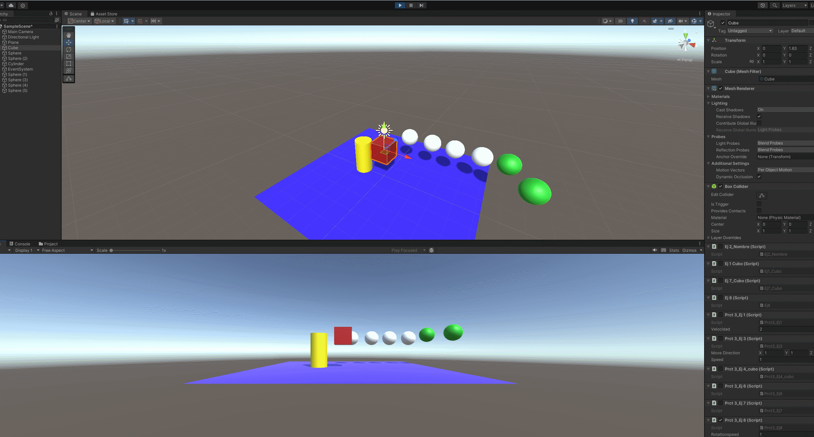
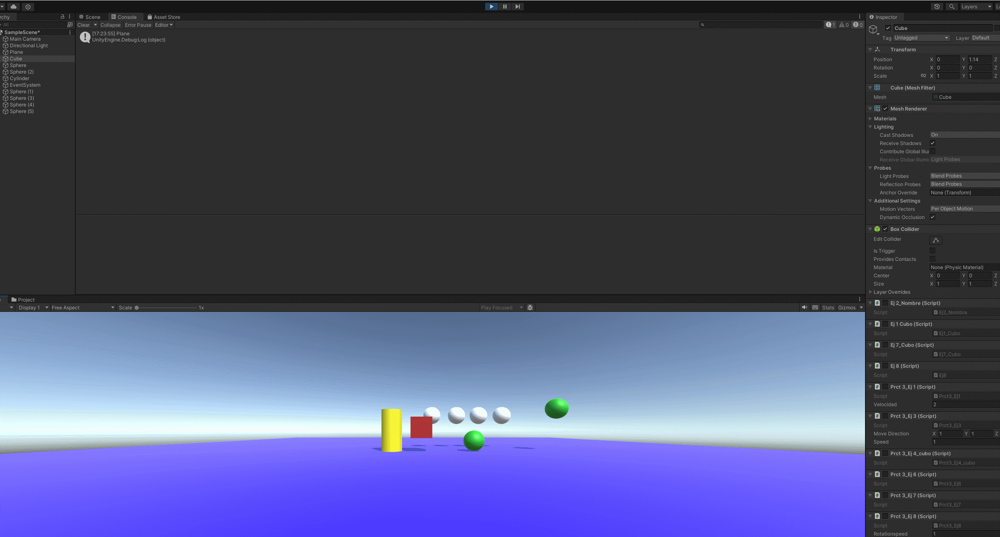
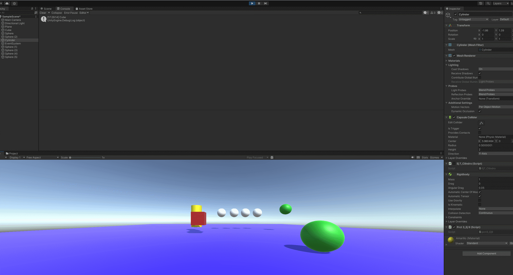

# Practica 3 - Fisicas

## Ej1
Mostrar velocidad e input por pantalla.

## Ej2
Cambiamos el boton asignado a fire 1 a h

## Ej3
- Duplicas las coordenadas de la dirección del movimiento: Incrementa la velocidad a la que se mueve *2.
- Duplicas la velocidad manteniendo la dirección del movimiento: Incrementa la velocidad a la que se mueve *2,
- La velocidad que usas es menor que 1: Decrementa la velocidad a la que se desplaza proporcionalmente
- La posición del cubo tiene y>0 : Procede a el movimiento desde la posicion y inicial, siendo la y inicial mayor a 0.
- Intercambiar movimiento relativo al sistema de referencia local y el mundial: Se mueve en la direccion referente al eje general o sea el del mundo.

## Ej4
Mover la esfera y el cubo independientemente mediante inputs

## Ej5
Se pide adaptar el movimiento mediante Deltatimne, lo cual ya hicimos antes

## Ej6
Modificar el anterior script para que el cubo se mueva hacia la esfera, eje y excluido

## Ej7
Modificar el anterior script para que el cubo se rote hacia la esfera

## EJ8
Cambiar el eje para que siempre avanze

## Ej9
Crear un mensaje al colicionar con el cilindro del objeto con el que colisionó

## Ej10
Lo mismo pero ciendo el cubo kinematic y la sefera un objeto rigidbody

## Ej11
Lo mismo pero siendo el cilindro un objeto trigger, no hizo falta cambiar ningun script unicamente quitarle la gravedad.

