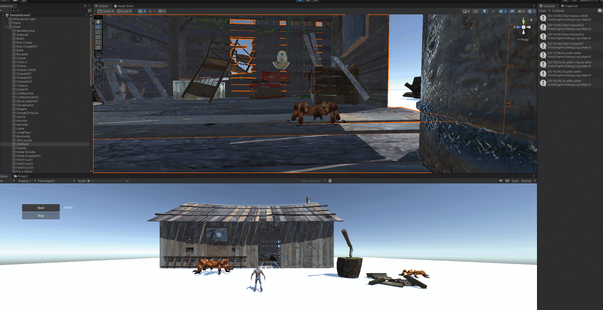

# Reconocimiento por voz
* author: Kilan González
* email: alu0101222325@ull.edu.es

# Ejercicio 1
Crearemos una apk a partir de la escena de ejemplo de HugginFace, esta se llamará Reconocimiento_Voz.apk

# Ejercicio 2
Aprovecharemos la escena del exámen para que cuando la araña designada (se designará con el espacio y se verá más brillante) este en escucha y dependiendo de lo que digamos hará lo siguiente
* Jump: Saltar
* Back: Ir hacia atrás
  

También podrá encontrar un video donde se ve una ejecución algo más exaustiva
_Capturas/Muestra.mp4_
