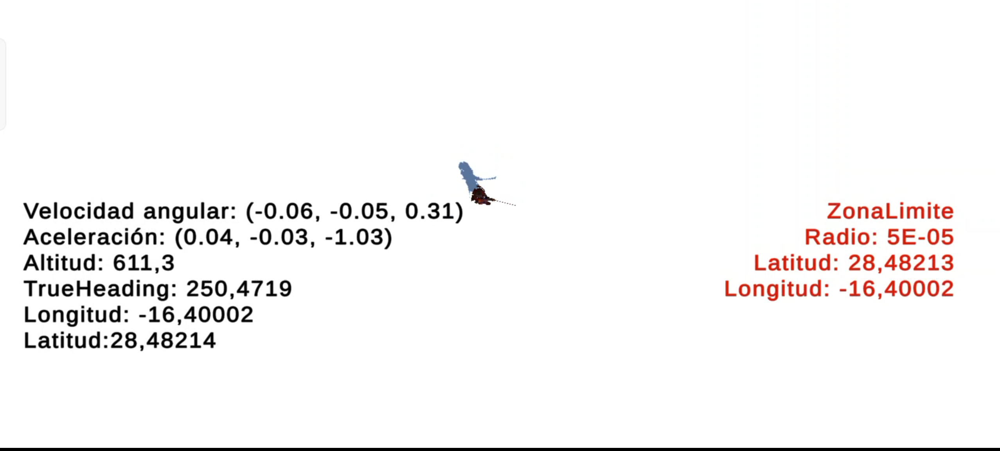
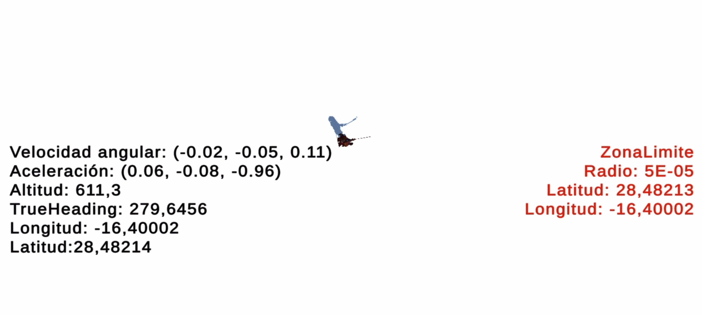

# Sensores: 
* author: Kilian González Rodríguez
* email: _alu0101222325@ull.edu.es_

# Ejercicio 1:
Debido a problemas para asistir el viernes debido al accidente que ocurrio en la autopista, se mostraran las imágenes capturadas dentro de mi casa y a posteriori del centro de cálculo y en la puerta de la facultad.

**En mi casa**
  

**Dentro del dentro de cálculo. Aun no**

**En la puerta de la facultad. Aun no**

# Ejercicio 2:
El samurai siempre apuntará con su espada al norte independientemente de como se mueva el móvil, además de desplazarse hacia adelante mientras se esté dentro del radio de coordenadas permitido. 
  
